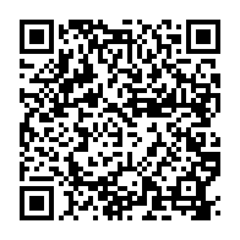

# Persona 3 Dual

A Nintendo DS demake of **Persona 3**, developed in C++ using devkitPro. Based on the **Persona 3** series of games and inspired by the **Persona 3 Dual** online joke.
> Want to help? Join the [Discord!](https://discord.gg/CQnkc5gS6a) Any help, big or small, would be greatly appreciated!


[](#)
[](#)


[](https://discord.gg/CQnkc5gS6a)


[](http://www.youtube.com/watch?v=4RW8ppcPK6o "Persona 3 Dual (First Look)")

---

## Running the Game

The game requires FAT filesystem support to load assets at runtime. Currently, we only support:

- **[melonDS](https://melonds.kuribo64.net/downloads.php)** (multiplatform emulator)
- **Real DS / DSi / 3DS hardware** via [TWiLight Menu++](https://wiki.ds-homebrew.com/twilightmenu/)

> Other flashcard launchers may work, but are untested

### melonDS (Emulator)

1. Download `persona-3-dual.nds` and `sdcard.img.gz` from the latest release, & decompress `sdcard.img.gz` **Developers**: Build the project with `make` - this produces both `persona-3-dual.nds` and `sdcard.img`.
2. In melonDS, go to **Settings → DLDI** and enable DLDI.
3. Set the SD card image path to the generated `sdcard.img`.
> **Do NOT enable "Sync SD card to folder"**. This will wipe the contents of the folder!

Now, you can open melonDS and load the `persona-3-dual.nds` ROM!


### Real Hardware (DS / DSi / 3DS)
#### Method 1: Manual Download
Requires [TWiLight Menu++](https://wiki.ds-homebrew.com/twilightmenu/) with DLDI patching enabled.

1. Download `persona-3-dual.nds` and `data.zip` from the latest release, & decompress `data.zip`
**Developers**: Build the project with `make` - this produces the `persona-3-dual.nds` and the content in `/data`.
2. In TWiLight Menu++ settings, ensure **DLDI access** is set to **ARM9** & the **Game Loader** is set to **nds-bootstrap**
3. On your SD card, navigate to your `/roms/nds/` folder (or equivalent).
4. Copy `persona-3-dual.nds` and the entire `/data` folder into that directory:
   ```
   /roms/nds/
   ├── persona-3-dual.nds
   └── data/
       ├── music/
       ├── video/
       └── ...
   ```
5. Launch the game through TWiLight Menu++ as normal.

#### Method 2: Automatic Download with Universal Updater (3DS Only)
1. Install [Universal Updater](https://github.com/Universal-Team/Universal-Updater/releases) if you haven't already
2. Open Universal Updater, go to **Settings** > **Select UniStore** > tap the **+** icon at the bottom
3. Scan the QR code below with the QR icon, or tap the keyboard icon and enter the URL manually:



> `https://raw.githubusercontent.com/p3d-project/persona-3-dual/main/unistore/p3d.unistore`

4. Find **Persona 3 Dual** in the store and tap **Install/Update**

---

## Developer & Artist Setup
See [ONBOARDING.md](ONBOARDING.md)

---

## Roadmap

See the [Project Board](https://github.com/orgs/p3d-project/projects/1) for current progress and open issues.

### Milestone 1: The Initial Demo

**Goal:** Lay the foundation of the game. Focused on implementing core engine features, basic systems, and getting our workflow documented. The grand finale of this phase is a polished promotional video showcasing our progress to try and recruit volunteers to the team.

**Key Deliverables:**

* **Environments & Models:** Getting characters moving around Iwatodai Dorm, Paulownia Mall, and other environment models, with optimized models. Initial implementation of the initial move-in intro sequence.
* **User Interface:** Building out the foundational UI, including the top-corner calendar display, dialogue boxes with custom backgrounds, and a clean console-style battle menu. We are also laying the groundwork for FEMC palette swaps.
* **Under the Hood:** Setting up dummy zones for battle and dialogue testing, adding basic save data functionality, implementing asset streaming, and finalizing the PersonaUniversalToolchain.

---


---

*This is a fan project and is not affiliated with or endorsed by Atlus or Sega. We (the team & the project) will not accept any monetary donations or funding for this project, nor will we make money from this project. We (the team & the project) do not enable, condone, or endorce piracy.*
